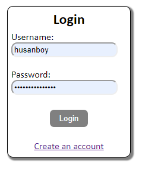
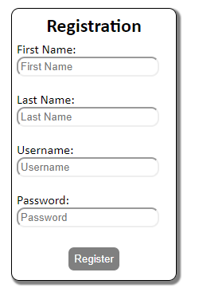
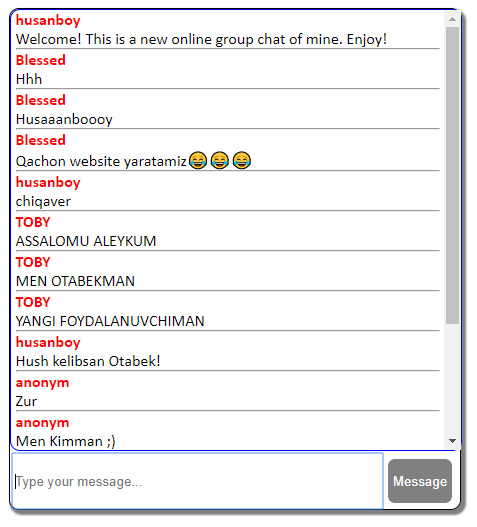
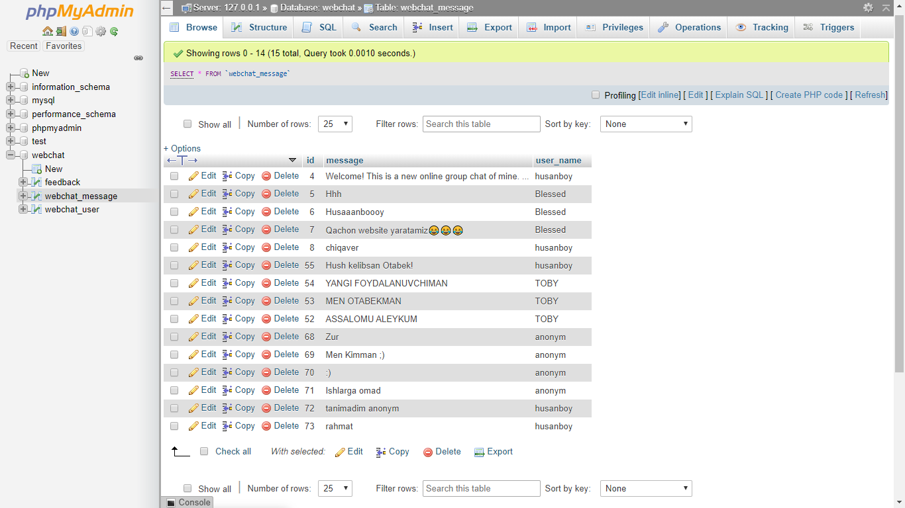

# webchat

<h4>PHP 7.4, MariaDB, Apache 2.4, </h4>

Webchat is a system that allows users to communicate in real time using easily accessible web interface. It is a type of online chat distinguished by its simplicity and accessibility to users who do not wish to take the time to install and learn to use specialized chat software. This trait facilitates users instantaneous access and only a web browser is required to chat. Users will always get the latest version of a chat service because no software installation or updates are required.

<h3>Below are screenshots of login, register and main pages and a showcase of how backend database is stored.</h3>

Any improvements or modifications are welcomed! Download the project, design it using CSS or its layout using HTML. Feel free to add any other features using PHP or JavaScript and create Issues and Pull requests here and I will merge them!

How To Run The Website?

To run this project, you must have installed a virtual server i.e XAMPP on your PC (for Windows) or LAMPP on your Linux machine. Webchat is an open-source project and is free to download, Use for educational purposes only!

After Starting Apache and MySQL in XAMPP on your computer, come here and go with the following steps.

1st Step: Click on "Clone or Download", download as ZIP

2st Step: Extract folder "webchat-master", rename it to "webchat"

3nd Step: Copy the "webchat" folder 

4rd Step: Paste it in C:\xampp\htdocs

5th Step: Open a browser and go to URL “http://localhost/phpmyadmin/”

6th Step: Then, click on the databases tab

7th Step: Create a database named “webchat” and then click on the import tab

8th Step: Click on browse file and select “webchat.sql” file

9th Step: Click on go.

After setting up Database,

10th Step: Open your browser and go to URL “http://localhost/webchat/”

<h2>coded and designed by Husanboy Qodirov</h2>
